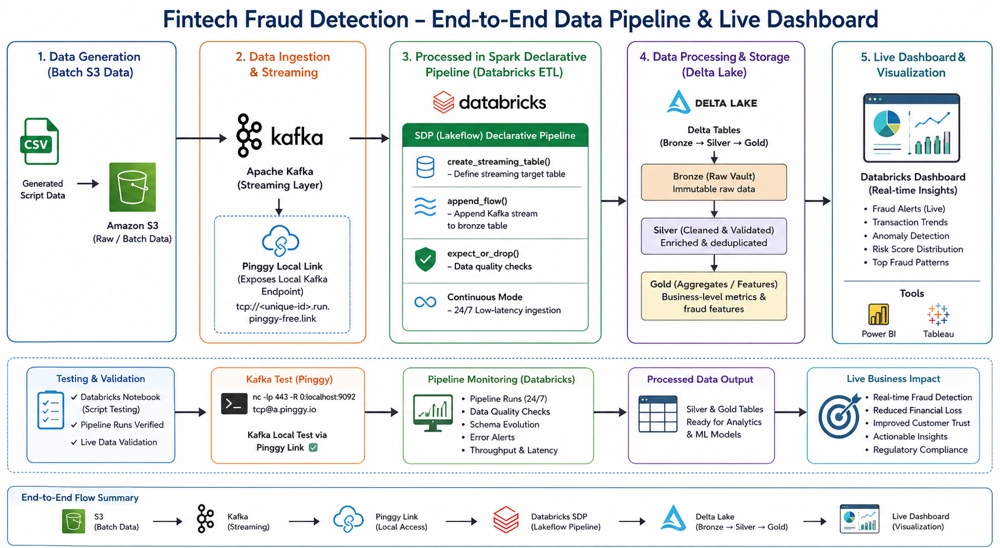
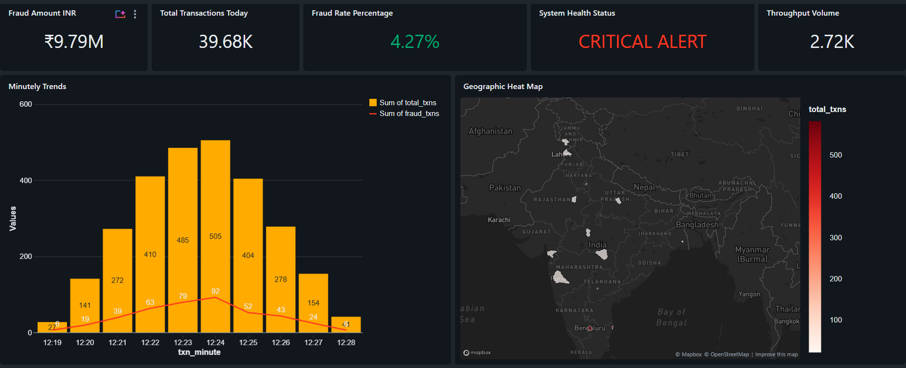
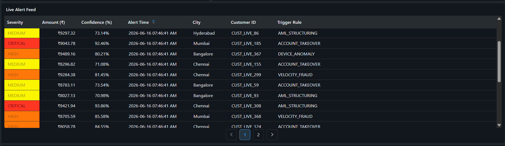
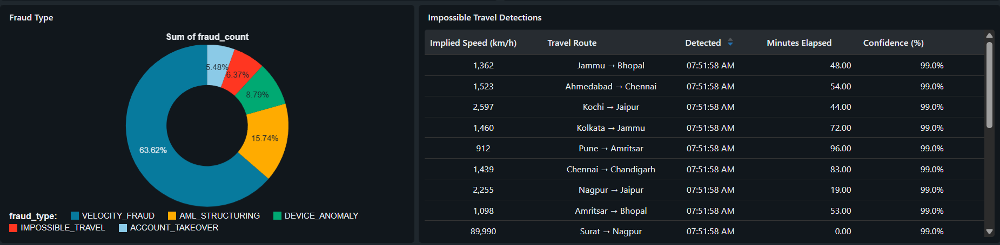
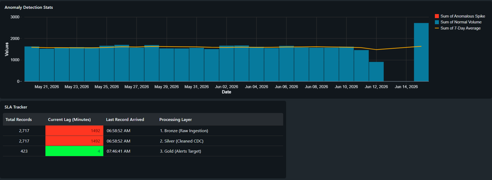

# Real-Time Fintech Fraud Detection Lakehouse

**Watch the full project walkthrough and live Kafka streaming demonstration here:**
▶️ **[Insert Link to your unlisted YouTube Video Demo Here]**

## Project Overview
This project is an end-to-end data engineering pipeline built on **Databricks** utilizing the **Medallion Architecture (Bronze, Silver, Gold)**. It is designed to process simulated real-time financial telemetry, specifically handling complex data scenarios like live Kafka streaming, slowly changing customer dimensions (SCD), and spatial-temporal fraud math.

The pipeline continuously ingests live transactional data via a public TCP tunnel, cleanses it, enforces strict data quality gates, and models it for sub-minute downstream Business Intelligence alerting.

## Architecture & Tech Stack

*   **Message Broker:** Apache Kafka (Local via Pinggy TCP Tunnel)
*   **Cloud Storage:** AWS S3 (Landing Zone for Historical Batch Data)
*   **Compute & Orchestration:** Databricks Delta Live Tables (DLT)
*   **Data Processing:** PySpark, Spark SQL, & Spark Declarative Pipelines (SDP)
*   **Storage Format:** Delta Lake
*   **Visualization:** Databricks SQL Dashboards

## Key Engineering Achievements
*   **Unified Streaming & Batch Ingestion:** Implemented Databricks **Auto Loader** alongside Structured Streaming to simultaneously ingest thousands of JSON/CSV historical records from S3 and continuous live binary streams from Kafka.
*   **Declarative Change Data Capture (CDC):** Built robust PySpark declarative flows in the Silver layer utilizing `dlt.apply_changes()` to handle **SCD Type 2 (Historical Tracking)** for customer profile and risk score updates without writing complex MERGE statements.
*   **Advanced Spatial-Temporal Analytics:** Engineered the Gold layer to detect "Impossible Travel" by utilizing PySpark Window functions (`LAG()`) and the complex Haversine formula to calculate geographic distance and implied speed between consecutive transactions in real-time.
*   **Notebook-Native CI/CD Testing:** Designed a custom **PyTest** framework that safely mocks active Spark sessions, allowing unit and integration tests to run natively within Databricks Serverless notebook environments.
*   **Stream-Static Joins:** Dynamically joined infinite Kafka transaction streams against static S3 FX-rate snapshots for real-time currency normalization without inducing network shuffle latency.

---

## Business Intelligence & Dashboards
### 1. The Real-Time Operations Command Center
*Tracks live Gross Fraud Value, total daily transactions, and maps live incident geographic hotspots across India to monitor real-time threat vectors.*
Operations Dashboard
**

### 2. Live Incident Alert Feed
*Visualizes sub-minute alert feeds categorized by severity (CRITICAL, HIGH, MEDIUM).*
Alert Feed
**

### 3. Fraud Type Distribution & Impossible Travel Engine
*Features a donut chart breaking down the sum of fraud counts by category (Velocity Fraud, AML Structuring, Device Anomaly, Impossible Travel, Account Takeover). Alongside it, a detailed "Impossible Travel Detections" table tracks extreme geographic anomalies in real-time, displaying implied travel speeds (e.g., Surat → Nagpur at 89,990 km/h in 0.00 minutes), travel routes, elapsed time, and 99.0% confidence scores.*
Fraud Type & Impossible Travel Dashboard
**

### 4. Statistical Anomaly Detection & Pipeline SLA Tracker
*Monitors the end-to-end health of the data pipeline tracking sub-minute processing lag across Bronze, Silver, and Gold layers, while utilizing 7-day Z-Score rolling averages to detect unusual volume spikes.*
Anomaly Detection
**

---

## 📂 Repository Structure
<pre>
fintech-fraud-detection/
├── README.md                                 # Main project documentation
│
├── dashboard/                                # BI & Visualization Exports
│   └── Real-Time Fraud Detection             # Databricks SQL Dashboard definitions
│
├── data_generation/                          # Raw Data & Simulation Generators
│   ├── s3/                                   # Historical batch data landing simulation
│   └── generate_transactions                 # Kafka stream & synthetic fraud injection logic
│
├── kafka_streaming/                          # Kafka Infrastructure & Producer
│   ├── docker-compose.yml                    # Kafka cluster container orchestration
│   └── kafka_producer.py                     # Real-time transaction stream producer
│
├── Pipeline/                                 # DLT Pipeline Definitions
│   └── transformations/                      # Spark Declarative Pipelines (SDP)
│       ├── advanced features/                # Anomaly detection & monitoring metrics
│       │   └── advanced_features.py
│       ├── bronze/                           # Auto Loader & Kafka Streaming Ingestion
│       │   └── bronze_transactions_streaming.py
│       ├── data_quality/                     # Enterprise-grade validation & expectations
│       │   └── data_quality.py
│       ├── gold/                             # Fraud Analytics, Velocity & Impossible Travel
│       │   └── gold_fraud_aggregates.py
│       └── silver/                           # CDC, Deduplication, Cleaning & SCD Type 2
│           ├── silver_transactions_cdc.py
│           └── silver_transactions_s3.py
│
├── setup/                                    # Environment & Catalog Initialization
│   ├── 00_environment_setup
│   └── 01_catalog_schema_setup
│
└── testing/                                  # Notebook-Native CI/CD Framework
    ├── test_fraud_pipeline                   # PyTest execution notebook
    └── test_fraud_pipeline.py                # Unit & Integration test suites
</pre>